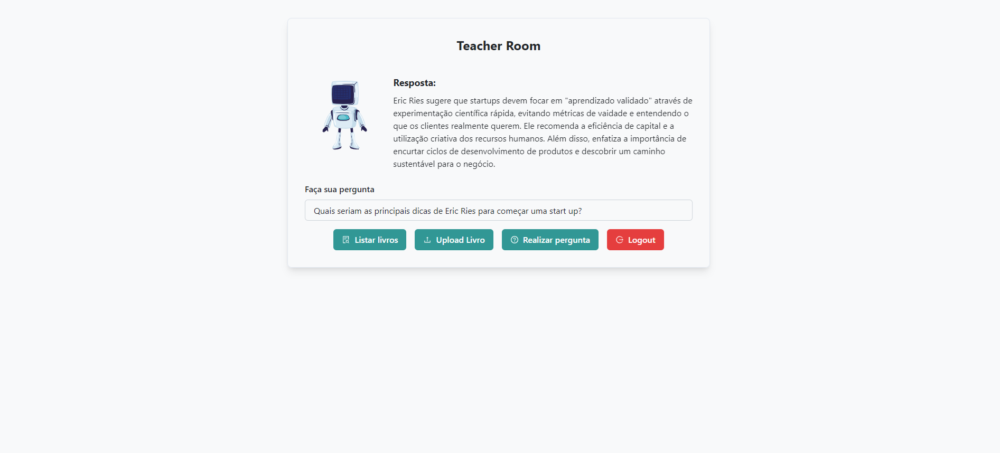

# Your Teacher

## Overview

Your Teacher is an application designed to assist users in interacting with PDF files and answering questions about their contents. The project is a monorepo containing both the front-end and back-end parts of the application.

## Getting Started

Follow these instructions to set up and run the project on your local machine.

### Prerequisites

1. **MySQL Database**

   Ensure you have MySQL installed on your machine. If not, you can set up a MySQL container using Docker with the following command:

   ```sh
   docker run --name mysql-container -e MYSQL_ROOT_PASSWORD=root -e MYSQL_DATABASE=yourdatabase -p 3306:3306 -d mysql:latest

Replace `yourdatabase` with your preferred database name. The default root password is set to `root`. Adjust these values as needed.

## Node.js

Ensure you have Node.js and npm installed. You can download and install them from [nodejs.org](https://nodejs.org/).

## Setting Up the Environment

### Clone the Repository

Clone the repository to your local machine:

```sh
git clone git@github.com:hgo19/your-teacher.git
cd your-teacher
```

## Create Environment Files

In both the front-end and back-end directories, copy the `.env.example` file to `.env` and update it with your environment-specific settings.

```sh
cp .env.example .env
```

Edit the .env file to configure environment variables such as database credentials and API keys.

## Running the Backend

### Install Dependencies

Navigate to the back-end directory and install the required dependencies:

```sh
cd backend
npm install
```

###  Execute Database Migration

Before running the backend server, you need to execute the database migration. Run the following script:

```sh
npm run db:migrate
```

### Start the Backend Server

Start the backend server with:

```sh
npm run dev
```

## Running the Frontend

### Install Dependencies

Navigate to the front-end directory and install the required dependencies:

```sh
cd ./frontend
npm install
```

### Start the Frontend Server

Start the front-end server with:

```sh
npm run dev
```

## Important: Account Creation Required

Before logging in, you need to create an account. Please visit the following path in the application to sign up:

```
/signup
```

Follow the prompts to register your account. Once your account is created, you will be able to log in and access the application.

## Your home page
Your home page will be something like this, and you are free to explore


